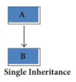
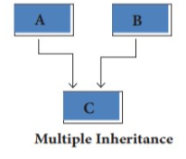
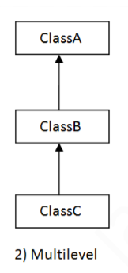
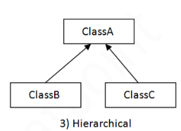
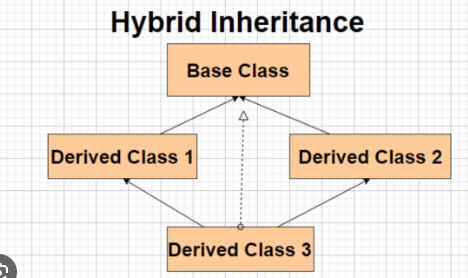

# Object Oriented Programming

Object-oriented programming (OOP) is a programming paradigm based on the concept of "objects," which can contain data (attributes) and code (methods). Objects are instances of classes, which serve as blueprints for creating objects. OOP emphasizes the organization of code into manageable, reusable components.

## OOPs concepts in Python

1. Class
2. Object
3. Polymorphism
4. Encapsulation
5. Inheritance
6. Data Abstraction

## 1. Class

Classes are like a blueprints for creating objects. They define the properties(attributes) and behaviours (method) of objects. You can create class using the 'class' keyword followed by the class name.

### Syntax to create class

```python
class ClassName:
    #   Class variables(Properties or attributes)
    #   methods(function) go here

```

### Car Class Example

Below is an example of a `Car` class in Python:

```python
class Car:
    def __init__(self, make, model, year):
        self.make = make
        self.model = model
        self.year = year

    def display_info(self):
        print(f"Make: {self.make}, Model: {self.model}, Year: {self.year}")

```

**Explanation**

In above code, simple Python class named Car. This class represents a blueprint for creating car objects. Let's break down the components of this class:

**Constructor (**init**):** This method is called when a new instance of the Car class is created. It initializes the attributes of the object (make, model, and year) with the values passed as arguments.

**Attributes (make, model, and year):** These are properties of the Car class, representing the make, model, and year of the car, respectively.

**Method (display_info):** This method is defined to display information about the car object. It prints out the make, model, and year of the car using formatted strings.

### self

In Python, `self` represents the instance of the class being used. It allows access to attributes and methods of the class. Using `self` binds attributes with given arguments. Python doesn't use the `@` syntax for instance attributes, so `self` is necessary to refer to them. It's customary to use `self` as the first parameter in instance methods. When calling a method of an object, the object is automatically passed as the first argument using `self`. This enables modification of the object's properties and execution of tasks unique to that instance.

## 2. Object

Object is an instance of a class. It is a real world entities. Everything in python is an object, including integers, strings, lists, function and classes themselves.
Object have attributes that represent their state and method that define their behaviour

### Creation of object

To create an object (instance) of the Car class provided earlier, you simply need to call the class name with the required arguments for the **init** method. Here's how you can do it:

```python
# Create an object (instance) of the Car class
car = Car("Toyota", "Camry", 2020)

# Access attributes and call methods of the car object
print(car.make)      # Output: Toyota
print(car.model)     # Output: Camry
print(car.year)      # Output: 2020
car.display_info()   # Output: Make: Toyota, Model: Camry, Year: 2020

```

## Full Code

```python

# Creating class of Car name
# with attribute make, model and year
# display_info(self) method to display information in terminal
class Car:
    def __init__(self, make, model, year):
        self.make = make
        self.model = model
        self.year = year

    def display_info(self):
        print(f"Make: {self.make}, Model: {self.model}, Year: {self.year}")

# Create an object (instance) of the Car class
car = Car("Toyota", "Camry", 2020)

# Access attributes and call methods of the car object
print(car.make)      # Output: Toyota
print(car.model)     # Output: Camry
print(car.year)      # Output: 2020
car.display_info()   # Output: Make: Toyota, Model: Camry, Year: 2020
```

## 3. Inheritance

Inheritance is a fundamental concept in object-oriented programming (OOP) that allows new classes to be created based on existing classes. Inheritance enables code reuse and promotes a hierarchical relationship among classes.

### Advantage of inheritance

Here are the advantages of inheritance in object-oriented programming:

1. **Code Reusability:**
   Inheritance allows subclasses to reuse attributes and methods from their superclass(es), reducing code duplication. Common functionality can be defined once in a superclass and inherited by multiple subclasses.

2. **Modularity:**
   Inheritance promotes modular design by allowing classes to be organized into a hierarchy based on their relationships. Each class can focus on a specific aspect of functionality, leading to clearer and more maintainable code.

3. **Extensibility:**
   Subclasses can extend the functionality of their superclass(es) by adding new attributes and methods or by overriding existing ones. This allows for incremental development and easy customization of classes without modifying the original code.

4. **Polymorphism:**
   Inheritance enables polymorphism, which allows objects of different classes to be treated uniformly through a common interface. This promotes flexibility and interoperability in code, as objects can be passed as arguments or returned from functions without knowing their specific types.

5. **Hierarchy and Organization:**
   Inheritance provides a natural way to model hierarchical relationships between classes. This can mirror real-world relationships and make the code easier to understand and maintain.

6. **Encapsulation:**
   Inheritance can facilitate encapsulation by allowing access control mechanisms, such as public, protected, and private members, to be inherited by subclasses. This helps in controlling access to class members and enforcing data hiding principles.

7. **Code Maintainability:**
   Inheritance improves code maintainability by reducing redundancy and promoting a hierarchical structure that makes it easier to locate and modify code. Changes made to a superclass automatically propagate to all its subclasses, reducing the risk of introducing bugs.

Inheritance is a powerful mechanism in object-oriented programming that enhances code organization, promotes reuse, and facilitates extensibility and maintainability. It plays a crucial role in designing flexible and modular software systems.

In Python, inheritance is achieved by creating a new class that derives from an existing class. The new class is called a subclass or derived class, and the existing class is called a superclass or base class.

Here's how inheritance works in Python:

1. **Defining a Base Class (Superclass):** You can start by defining a base class with attributes and methods that you want to reuse or extend in subclasses.

```python
class Animal:
    def __init__(self, name):
        self.name = name

    def speak(self):
        pass
```

2. **Creating Subclasses (Derived Classes):**
   You can now create new classes that inherit from the base class (Parent or Super Class). Subclasses can add new attributes or methods, override existing methods, or inherit attributes and methods from the base class.

```python
class Dog(Animal):
    def speak(self):
        return "Woof!"

class Cat(Animal):
    def speak(self):
        return "Meow!"
```

3. **Using Inherited Functionality:**
   Objects of the subclass inherit all the attributes and methods of the superclass. They can also define their own attributes and methods or override the superclass methods.

```python
dog = Dog("Buddy")
print(dog.name)   # Output: Buddy
print(dog.speak()) # Output: Woof!

cat = Cat("Whiskers")
print(cat.name)    # Output: Whiskers
print(cat.speak()) # Output: Meow!
```

Inheritance promotes code reuse, modularity, and extensibility. It allows programmers to create specialized classes based on existing ones, reducing redundancy and making code more organized and maintainable. Additionally, inheritance enables polymorphism, allowing objects of different classes to be treated uniformly through a common interface.

### Types of inheritance

In Python, like in many other object-oriented programming languages, there are several types of inheritance that you can use to create relationships between classes. These types include:

1. **Single Inheritance**: In single inheritance, a subclass inherits from only one superclass. This is the simplest form of inheritance.
   

   ```python
   class Parent:
       pass

   class Child(Parent):
       pass
   ```

2. **Multiple Inheritance**: In multiple inheritance, a subclass inherits from multiple superclasses. This allows the subclass to inherit attributes and methods from multiple sources. Python supports multiple inheritance, but it requires careful design due to potential conflicts, known as the "diamond problem."



```python
class Parent1:
    pass

class Parent2:
    pass

class Child(Parent1, Parent2):
    pass
```

3. **Multilevel Inheritance**: In multilevel inheritance, a subclass inherits from another subclass, creating a hierarchy of classes.



```python
class Grandparent:
    pass

class Parent(Grandparent):
    pass

class Child(Parent):
    pass
```

4. **Hierarchical Inheritance**: In hierarchical inheritance, multiple subclasses inherit from the same superclass, creating a hierarchy of classes.
   

```python
class Parent:
    pass

class Child1(Parent):
    pass

class Child2(Parent):
    pass
```

5. **Hybrid (or Mixin) Inheritance**: Hybrid inheritance is a combination of multiple inheritance and single inheritance. It involves the inheritance of features from multiple base classes, some of which may be implemented as mixin classes (classes that provide a specific functionality without being part of the main inheritance hierarchy).



```python
class Base1:
    pass

class Base2:
    pass

class Mixin:
    pass

class Child(Base1, Base2, Mixin):
    pass
```

### Overriding In Python

Overriding in Python refers to the ability of a subclass to provide a specific implementation for a method that is already defined in its superclass. When a method is overridden in a subclass, the subclass's implementation of the method takes precedence over the superclass's implementation. This allows subclasses to customize or extend the behavior of methods inherited from their superclasses.

Here's an example to illustrate method overriding in Python:

```python
class Animal:
    def make_sound(self):
        print("Generic animal sound")

class Dog(Animal):
    def make_sound(self):
        print("Woof!")

class Cat(Animal):
    def make_sound(self):
        print("Meow!")

# Creating instances of Dog and Cat
dog = Dog()
cat = Cat()

# Calling make_sound method on instances
dog.make_sound()  # Output: Woof!
cat.make_sound()  # Output: Meow!
```

In this example:

- The `Animal` class defines a `make_sound` method with a generic implementation.
- The `Dog` class and `Cat` class both inherit from the `Animal` class.
- Both `Dog` and `Cat` classes override the `make_sound` method with their specific implementations for making sounds.

When `make_sound` method is called on instances of `Dog` and `Cat`, Python resolves the method call based on the type of the object. It invokes the overridden method in the subclass, rather than the method in the superclass.

Method overriding is useful for customizing the behavior of methods inherited from superclasses to suit the requirements of subclasses. It allows for flexible and polymorphic behavior in object-oriented programming.

### Super()

In Python, super() is a function that allows you to call methods and access attributes from the parent class within a subclass. It's commonly used in situations where a subclass needs to extend or override the behavior of its parent class.

```
python

class Parent:
    def __init__(self, name):
        self.name = name

    def greet(self):
        return f"Hello, I'm {self.name}."


class Child(Parent):
    def __init__(self, name, age):
        super().__init__(name)  # Calling the parent class' __init__ method
        self.age = age

    def greet(self):
        # Calling parent class method using super()
        parent_greeting = super().greet()
        return f"{parent_greeting} I'm {self.age} years old."


# Creating instances of Child class
child = Child("Alice", 10)

# Calling methods
print(child.greet())  # Output: Hello, I'm Alice. I'm 10 years old.


```

#Special Method
